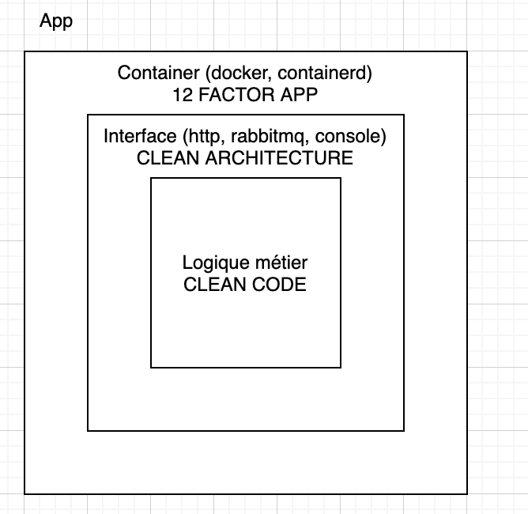
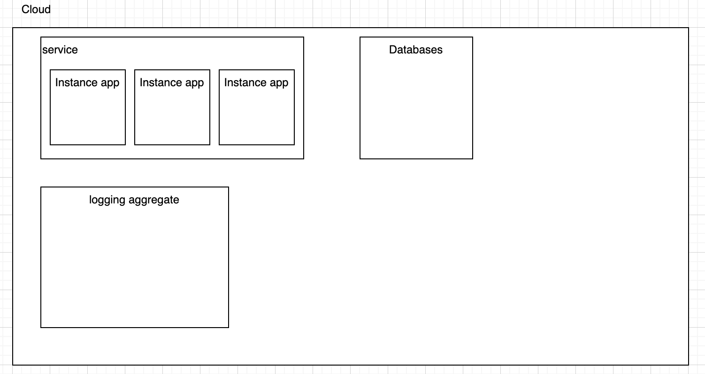

# 12 factors app, une méthode pour ranger ses micro-services

## Des principes cloud friendly

**Naïvement**, voici les composants et la famille de bonne pratique associée

### Cloud over simplifié

## Les principes

### Base de code unique

* Une seule base de code
* Un build, plusieurs déploiements

### Des dépendances explicites

* téléchargeables, ne dépendent pas de l'ordinateur (éviter gac, utilisation d'un VS spécifique)

### Configuration dans l'environnement

* Configurations et secrets sont enregistrés en tant que variable d'environnement
* Avoir un fichier de configuration est acceptable, mais non recommandé

### Les services externes sont à traiter comme des ressources local

* Changer une chaine de connection, de type de base de donnée (mysql -> sql server) ne nécessite pas de changement de code

### Séparez les étapes d'assemblage, publication et d'éxécution

* Un build
* L'assemblage des configurations se font en amont
* Le run time s'exécute plus tard

### Des processus sans états

* Share Nothing architecture. Les instances sont indépendantes en utilisation de CPU, mémoire et disk
* Pas de variable de session, ou de 'sticky session'

### Un service est associé a un port

* Identifiez vos services via le numéro de port

### La concurrence se scale horizontalement

* Ayez une architecture qui scale horizontalement. Un service est plus facile a scale en ajoutant des machines qu'en les grossissant

### Des instances jetable

* Les services ont pour intention d'être constamment déplacé. Ils peuvent s'allumer et s'éteindre a tout moment
* Les services doivent démarrer le plus vite possible, et s'éteindre gracieusement. Ils devront terminer leur requête, et ne plus accepter les nouvelles

### Parité dev prod

* Devops friendly, les applications doivent être codé et déployé par la même équipe
* Les différents environnements doivent utiliser la même infrastucture, et la même pile technologique

### Loggez en tant que stream

* Les logs doivent être traité en tant que stream dans stdout
* Pas de tampon ni de gestion de fichier local sur le serveur applicatif
* La persistance des logs se fait par l'environnement d'execution

### Les tâches d'administration sont géré comme tout autre process

* Les mises à jour des schémas sql ou n'importe quelle tâche 'one shot' doivent suivre le cycle de vie des 12 factors app. Ils doivent suivre les 11 premiers facteurs